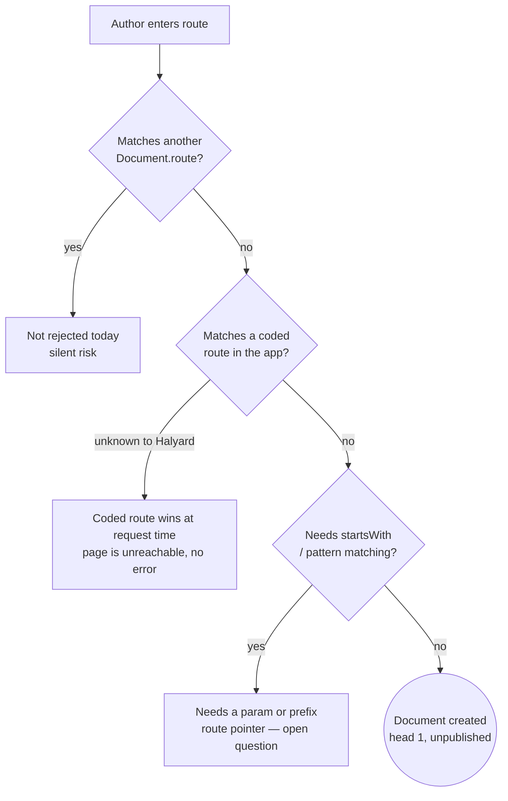
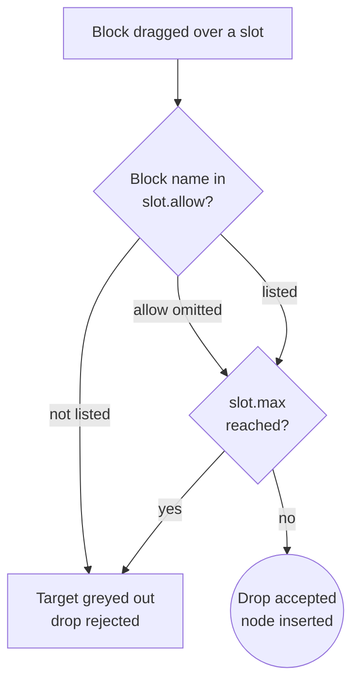
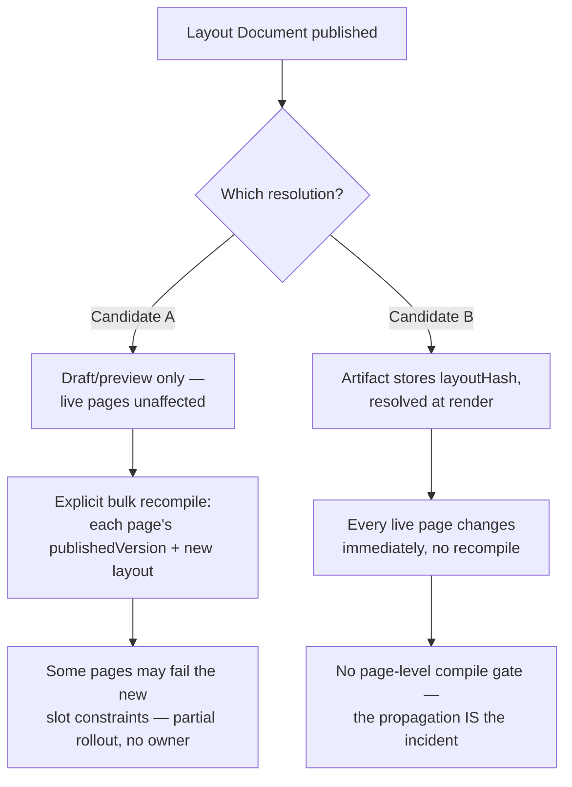

# Authoring flows

What an author does step by step, and where each flow is still unresolved. Every flow below
is Trigger → Steps → System → Failure modes, against the model in [`01`](domain-model.md),
the API in [`02`](api-sketch.md), and the canvas in [`04`](studio.md). The failure modes are
the point — several of them are open questions or review findings rather than settled
behavior, and are cited rather than resolved here.

## 1. Create a page

**Trigger:** author clicks "New page" in the studio.

**Steps:**
1. Choose a route — a literal path (`/promotions/summer`).
2. Pick a layout (a `Document` with `kind: "layout"`), or none.
3. Optionally start from a preset instead of blank. "Preset" is this document's working
   name; the stored enum value is still `kind: "template"` pending a rename tracked in the
   project's open design questions — see
   [GitHub issue 15](https://github.com/effekt/halyard/issues/15).

**System:**
- Blank start: `Document` created with `head: 1` and no route pointer, which is what "not
  yet published" means — there is no stored field saying so
  ([`01`](domain-model.md#documentversion)).
- From a preset: the preset's tree is cloned and **every node id in the subtree is
  remapped** via the one shared clone utility in `core` — ids are never regenerated for an
  existing document, but a clone is a new document, so nothing is shared
  ([`01`](domain-model.md#node--flat-while-authoring-nested-once-published)).

**Failure modes:**

| Mode | Consequence |
|---|---|
| Route collides with another `Document`'s route | Nothing rejects it today. `Artifact.route` is never checked against `Document.route`. Collision surfaces later, silently, as one document evicting the other on publish. |
| Route collides with a coded route in the consumer's app | Undetectable by Halyard — invariant 6 means Halyard has no visibility into the app's route tree. Next's file-system routing prefers an explicit route over the `[[...slug]]` catch-all, so the authored page is unreachable with no compile error and no publish error. |
| Route needs a pattern, not a literal | Real content needs this: a single entry commonly serves a whole family of URLs off a prefix or param rule, with the remaining segment read at render. A literal-only route table cannot represent that class at all — it is unrepresentable, not merely awkward. Open — tracked in the project's [open design questions](https://github.com/effekt/halyard/issues/15). |
| Layout reference is stale or wrong | `layoutId` is not validated against an existing layout `Document` anywhere in the current design. |

## 2. Compose

**Trigger:** drag a block from the palette, or act on a selected node.

| Action | Mechanics |
|---|---|
| Place | Allocate a new id, write `Node { id, block, props: defaults }`, insert the id into the target slot's ordered array (or root). |
| Reorder | Reindex the id within its slot array. No id changes. |
| Nest into a slot | Same as place, targeting a non-root slot. |
| Duplicate / paste | Clone the subtree, remap **every** id via the shared clone utility — id is generated once and never regenerated for the original ([`01`](domain-model.md)). |
| Delete | Remove the id from its parent's slot array. The orphaned entry in `elements` is detected the same way compile detects unreachable nodes. |

**System:** every operation is `elements[id] = …` against the flat `{ root, elements }`
shape, never a deep tree rebuild. Slot legality is a `SlotConstraint` (`allow` / `min` /
`max`) declared once on the block and read by both the compiler and the canvas — the same
declaration greys out an invalid drop target during drag ([`02`](api-sketch.md#slots-articulate-structure)).

**Failure modes:**

| Mode | Consequence |
|---|---|
| `slot.min` violated by a delete | Not blocked in the editor today — nothing in `04` specifies live min-enforcement on delete. Surfaces at publish as a `CompileError` with a node path. |
| `allow` names a typo'd or renamed block | Silently blocks that slot forever — `allow` has no referential integrity against the registry. Reads as an author-facing bug, not a config error. |
| A pasted/cloned subtree creates a cycle | Not achievable through normal drag; possible via direct API writes. The flat shape makes it detectable — a cycle cannot flatten into a tree, so compile fails rather than looping. |
| Cross-document composition (copy a node from one open page into another) | Undesigned. The canvas is one iframe over one document at a time ([`04`](studio.md)). |

## 3. Edit props

**Trigger:** select a node; the inspector renders its fields from `ui.order` / `ui.groups` /
`ui.fields`, control chosen by ranked tester ([`02`](api-sketch.md#control-resolution-ranked-testers-not-a-keyed-map)).

**Steps:**
1. Inspector holds local edit state while the author types.
2. **On debounce or blur**, commit: `elements[id].props` is written to the draft store.
3. The canvas — the real app in an iframe — reloads from the server against that draft.

**System:** the canvas does **not** live-patch as you type. `04` resolved this explicitly:
a true server component's code never reaches the browser, so client-side prop patching
can't work uniformly, and the drag adapter can't read dragged data mid-hover either — "the
canvas updates on commit, not continuously." Preview and canvas are the same server-render
path, given a draft version instead of an artifact.

**Failure modes:**

| Mode | Consequence |
|---|---|
| Invalid value against the block's schema | Validated on commit against the field's own sub-schema, and on blur against the whole node — the three tiers in [`02`](api-sketch.md#validation-happens-at-three-tiers-not-one). A draft may still hold invalid values indefinitely: blocking a save mid-edit is hostile, so publish is the gate, not save. |
| A field hidden by a discriminated union keeps a stale value | `02` names this directly (failure mode 5, the TinaCMS precedent): the value must be dropped **at compile**, not merely hidden in the editor. So what an author sees in the draft can be wider than what actually publishes. |
| Repeater rows keyed by index | Reordering `bullets[]` without a stable per-row key re-mounts every row and drops focus (`02` failure mode 6). |
| `data: "request"` blocks | Editing props only edits the block's declared parameters — the live-fetched half of its output can't be previewed without a real request round trip; there's no static-only inspector preview for it. |

## 4. Preview

**Trigger:** "Preview," or a viewport change.

**Steps:**
1. Draft preview is a real server render — the studio's preview route is the same code
   path as the public catch-all, given a draft document ([`04`](studio.md)).
2. Viewport switching: named presets read from the **consumer's own** breakpoints (for example:
   xs 320 · sm 480 · md 768 · lg 1024 · xl 1280 · 2xl 1440) plus free-drag. This works
   because the canvas is a true iframe — CSS2 §9.1.1, "at most one viewport per canvas."
3. Preview at content extremes: generate values from the schema's own bounds
   (`z.string().max(80)` → an 80-char and a 1-char value; `z.array(x).max(4)` → 4, 1, and 0
   if optional) and render that synthetic document through the same path.

**System:** schema work — validation, control resolution, extreme-value generation — happens
at publish and in the studio only. The production render path never parses a schema; it
reads an already-validated artifact ([`04`](studio.md)).

**Failure modes:**

| Mode | Consequence |
|---|---|
| `data: "request"` block previewed at extremes | Only the static-declared props vary; the fetched half renders real, unrelated live data next to a synthetic extreme — no static-only preview mode exists. |
| Schema shapes `toJSONSchema()` can't represent | bigint, `Date`, branded types, discriminated unions (which emit `oneOf`, not `if/then/else`) — extreme-value generation for these needs the same explicit-control escape hatch `02` names for editing (failure mode 7), and it isn't designed for stress-content generation specifically. |
| Consumer doesn't expose its breakpoint config discoverably | Viewport presets have no defined fallback — falls back to inventing sizes, which is the exact thing `04` designed against. |
| Preview environment unreachable | No client-only degraded mode — `04` removed the live postMessage path entirely, so preview fails outright rather than degrading. |

## 5. Publish / unpublish / schedule / rollback

**Trigger:** publish, unpublish, rollback, or (see below) schedule.

**Steps:** `compile(documentVersion, catalog)` → on success, `store.write(artifact)` →
`store.publish(route, hash)` swaps that route's pointer, one atomic record
([`01`](domain-model.md#compile-and-publish)). Unpublish is `store.unpublish(route)` —
the artifact is untouched, so republish and rollback are both pointer moves, never a
recompile.

**Schedule is not modeled.** There is no `scheduledAt` field, no job runner among the
adapters, and `store.publish()` is synchronous. Recorded as one of the project's open
design questions (see [GitHub issue 15](https://github.com/effekt/halyard/issues/15)),
where the artifact model makes it unusually safe if added — the artifact is compiled and
validated before the schedule is set, so firing cannot fail on a surprise validation error.

**Failure modes:**

| Mode | Consequence |
|---|---|
| Compile fails | `CompileError { issues: [{ nodeId, path, code, message }] }`; the document stays on its previous artifact. |
| Rollback target no longer validates against the current registry | Rollback is a pointer move with no recompile, so frozen props from an older block version could feed a changed component. **Resolved:** `checkRollback` compares the artifact's `registryFingerprint` and `blockVersions` against the live registry before the swap, and either rejects or recompiles the historical version through the `migrate` chain ([`01`](domain-model.md)). |
| A live artifact's block is deleted from the registry | A **static** block is inert — its data is frozen into the resolved tree, no lookup at render. A **request-mode field is not**: it needs the registry at request time, so deletion breaks the live page with no republish involved. **Resolved:** the CI guardrail is a required, failing check, and deletion is treated as an incompatible version bump. |
| Route ownership | Unpublish a route, let another `Document` claim it, republish the first — the second is silently evicted. A uniqueness constraint on route → documentId is required and not yet implemented. |
| Concurrent publishes | **Resolved:** route pointers are independently-writable records, one per route, so two publishes to different routes cannot interfere. A single manifest document permitted a silent lost update. |
| `Document.publishedVersion` disagreeing with what is live | **Resolved:** `publishedVersion` is derived on read from the route pointer rather than stored, so there is no second copy to diverge. |
| Artifact pruning | Rollback depends on the target artifact still existing. Retention must respect a stated rollback window, and `publish()` must reject a missing hash rather than wiring a dead pointer — see [`adapters.md`](https://github.com/effekt/halyard/blob/main/.claude/rules/adapters.md). No policy is set yet. |

## 6. Layouts vs presets

| Behaviour | Layout | Preset (`kind: "template"`) |
|---|---|---|
| Editing it | Propagates to every page that references it — in principle | Affects nothing already created; no ongoing link after clone |
| Used at | Every render of a page that references it | Once, at page creation (flow 1) |

Preset cloning has no failure mode beyond what any document already has: a preset's stored
prop shapes get validated fresh at the new page's first compile, same as stale content
anywhere else.

**Layout propagation is unresolved — say so rather than pick.** Artifacts inline fully
resolved content and record no layout dependency at all
([`01`](domain-model.md#node--flat-while-authoring-nested-once-published) — `ArtifactNode`
has no lookups by design). So, as currently specified, publishing an edited layout changes
nothing already live: every page compiled against the old layout keeps rendering it, silently,
forever, until something explicitly recompiles it. There is no fan-out mechanism specified. Related and also open: whether a page may fill more than one
named layout slot ([`01`](domain-model.md#open-questions), question 2).

**Candidate A — propagation is draft/preview only.** A layout edit shows immediately in the
studio; a live page's artifact stays frozen until it is explicitly republished through a new
bulk-recompile operation, pinned to each page's `publishedVersion` (never `head`, or an
in-progress draft edit ships as a side effect of the layout change).

**Candidate B — layouts resolve at render, not at compile.** The artifact stores a
`layoutHash` and the render path joins it at request time. This trades away part of "an
artifact is fully resolved, no lookups possible" for any page using a layout — the one
place in the Output layer that would need a runtime reference.

Either way, `Artifact` needs to record a layout dependency the way it already records
`blockVersions`, so staleness is at least detectable — that much both candidates agree on.
See the project's [open design questions](https://github.com/effekt/halyard/issues/15).

## 7. Collaboration

**Trigger:** a second author opens a document already open elsewhere.

The minimum viable answer is a pessimistic lock per `Document`, and it is explicitly
unconfirmed: "worth confirming it is enough before the studio assumes it"
([`01`](domain-model.md#open-questions), question 6; open design questions,
[issue 15](https://github.com/effekt/halyard/issues/15), question 13).
Nothing below is designed in `02` or `04` — no lock entity in `01`, no lock/unlock call on
`ArtifactStore` or elsewhere, no session heartbeat mentioned anywhere.

**What it would need, minimally:** lock owner, acquired-at timestamp, and a release
condition — explicit close, or a heartbeat/TTL for a crashed tab.

**What the second author sees:** canvas and inspector render normally, but every commit is
refused; an indicator names who holds the document. They can read and preview, not edit.

**Failure modes:**

| Mode | Consequence |
|---|---|
| Stale lock | First author's tab crashes without releasing. No TTL/heartbeat is specified, so the document can be locked out indefinitely with no defined "break glass" unlock. |
| Granularity | A document-wide lock blocks two authors editing unrelated nodes in the same page (a hero and a footer) even though the flat `{root, elements}` model doesn't require that granularity — node-level locking or per-node merge is deferred, not ruled out. |
| Direct API writes bypass the lock | Nothing in `01`/`02` gates `elements[id] = …` behind lock ownership — the lock is a studio-UI convention unless a server enforces it, and that enforcement isn't specified. |
| Interacts with layout propagation | Locking the layout document doesn't stop a page depending on it from publishing mid-edit under Candidate B above — the lock's blast radius is "one document," the propagation's is every dependent page. |
