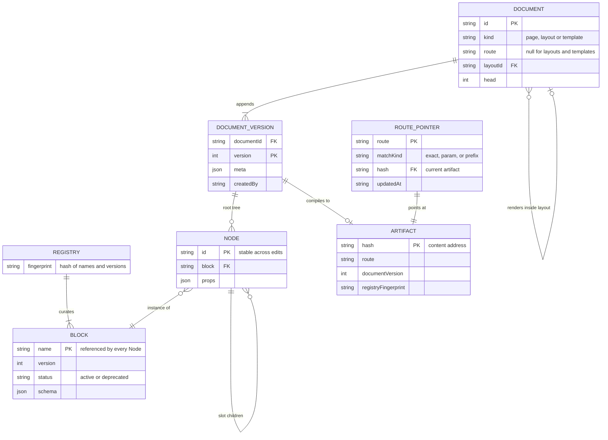
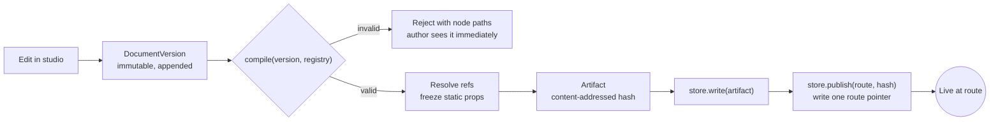
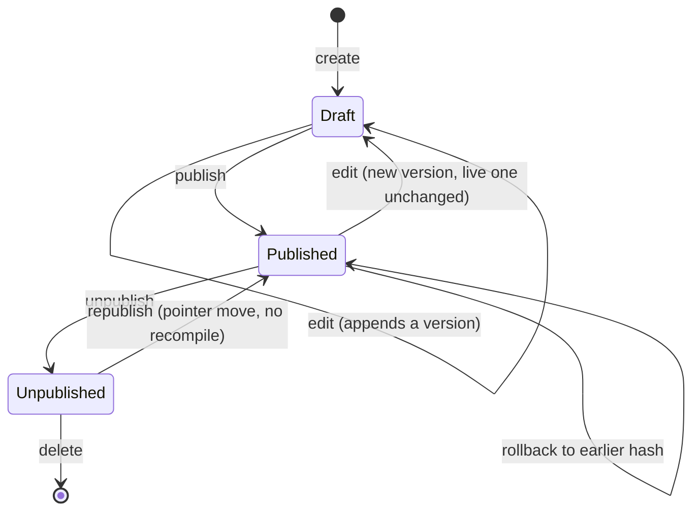

# Domain model

Every entity, what owns it, and where it lives. Types here are pseudocode — illustrative
shape, not the final signatures.

## The three layers again

| Layer | Entities | Lives in | Mutable? |
|---|---|---|---|
| Contract | `Block`, `Registry` | Code | Only by a commit |
| Content | `Document`, `DocumentVersion`, `Node` | Authoring database | Yes, by authors |
| Output | `Artifact`, `RoutePointer` | Artifact store | Artifacts never; pointers only |

## Relationships



Two edges carry most of the design. `NODE ||--o{ NODE` is the slot tree — the recursion the
compiler walks. `DOCUMENT }o--o| DOCUMENT` is a page pointing at its layout, which is why
layouts and templates can share one table despite behaving oppositely.

## Contract layer

### Block

A registered component plus the schema describing what it accepts. The unit of curation —
if it is not a block, an author cannot place it.

```ts
interface Block<Schema, Component> {
  name: string;              // stable identity, referenced by every Node — renaming is a migration
  schema: Schema;            // Standard Schema; props are inferred from it
  component: Component;      // generic, so core never imports React
  version: number;           // bumped when the schema changes incompatibly
  status?: "active" | "deprecated";  // deprecated stays resolvable; hidden from the studio's placement palette
  slots: Record<string, SlotConstraint>;  // named regions, and what may go in them
  migrate?: Record<number, (props: UnknownProps) => UnknownProps>;  // same-node prop reshaping only — cannot touch slots or split/delete a block
}

interface SlotConstraint {
  allow?: readonly string[];   // block names permitted here; omitted means any registered block
  min?: number;
  max?: number;
}
```

**A block is an organism.** Atomic Design's useful transfer is granularity: organisms are
"distinct sections of an interface", and templates place them "within a layout". A block is
a self-contained page section — a hero, an FAQ, a media carousel — never a button or an
input. Atoms and molecules are the consumer's design system and Halyard has no opinion
about them; registering a `Button` as a block is the shape of misuse to warn against.

Slots carry constraints rather than just names because Frost's templates "articulate the
design's underlying content structure" — a region that takes one-to-six section blocks is
structure, and a bare `string[]` cannot say it.

Editing hints are **not** on `Block` either. They live in a parallel `ui` structure keyed by
field path — see [`02-api-sketch.md`](02-api-sketch.md#where-ui-hints-live) for the decision
and why in-schema metadata was rejected.

`data` is not a field on `Block`. Block-level `"static" | "request"` forced an all-or-nothing
choice per block — a hero with a static headline and a live price could not be expressed
without forking it. It lives per field instead, alongside the other UI hints — see
[data lifecycle](02-api-sketch.md#data-lifecycle-is-a-field-hint-not-a-block-flag) in
`02-api-sketch.md`.

### Structural migration

`migrate` above only reshapes props for one node — it cannot touch `slots`, split one block
into two, or handle deletion. Real structural change (Sanity, Contentful, and Payload all
agree here) runs as an explicit, dataset-wide pass over documents, not a lazy per-node
upcaster invoked at compile:

```ts
interface StructuralMigration {
  from: string;   // registry fingerprint this expects going in
  to: string;      // registry fingerprint after
  run(version: DocumentVersion, registry: Registry): DocumentVersion;  // full tree access
}
```

A script reads every `DocumentVersion` a migration targets, calls `run()`, and appends the
result as a new version — an adapter concern, per invariant 5. Nothing mutates a historical
version in place; the migration produces new ones the same way authoring does.

### Registry

The curated set for one application. Resolves a `Node.block` string to a `Block`, and
produces a fingerprint that gets stamped into every artifact.

```ts
interface Registry {
  get(name: string): Block | undefined;
  names(): string[];
  fingerprint(): string;     // hash of every block name + version
}
```

The fingerprint is what makes the CI guardrail possible, and the guardrail is a required,
failing check, not an advisory report. A registry change runs against every artifact
currently referenced by a live route pointer; anything it would invalidate fails CI.
Deletion is treated identically to an incompatible version bump — both are checked, both can
fail the build, before either merges.

Deletion is two steps regardless. `status: "deprecated"` keeps a block resolvable —
`registry.get()` still returns it, so every existing `Node` referencing it keeps rendering —
while removing it from the studio's placement palette so authors cannot add new instances.
Hard removal follows once nothing references it — the same scan already described below,
over `elements` values for `block === name`, across every `DocumentVersion`.

## Content layer

### Document

The authored thing. One row per route, not one per environment — this is what makes
staging and production incapable of drifting.

```ts
interface Document {
  id: string;
  kind: "page" | "layout" | "template";
  route: string | null;      // pages have one; layouts and templates do not
  layoutId: string | null;   // the layout a page renders inside
  head: number;              // the version currently considered current
}
```

`publishedVersion` is not stored here. It duplicated a fact the route pointer already owns,
written to two datastores with no transaction spanning them — either write could succeed
alone. The route pointer is authoritative for what is live; `publishedVersion` is derived on
read: resolve `document.route`'s pointer, read the artifact it names, and take that
artifact's `documentVersion`. Derived beats stored here — it cannot go stale the way a
duplicated field can.

### DocumentVersion

Versions are immutable; authoring appends. "Publishing" moves a pointer rather than
mutating a row, which makes rollback symmetrical with publish and gives history for free.

**Autosave and versioning are two different things, not one.** An unbounded append on every
tick is what every mature system rejects: Payload overwrites a single debounced autosave
row; Figma collapses interstitial checkpoints and records real ones every 30 minutes;
Contentful only snapshots on publish. So:

| Layer | Granularity | Lives |
|---|---|---|
| Undo / redo | Per operation | Client working copy — IndexedDB, survives tab close |
| Autosave slot | Debounced tick, overwrites in place | The authoring store — mutable, not a version |
| `DocumentVersion` | Explicit save, periodic checkpoint, or publish | The authoring store — append-only |
| Artifact | Per publish | The artifact store |

```ts
interface AutosaveSlot {
  documentId: string;
  tree: Node[];
  slots: Record<string, Node[]>;
  updatedAt: string;
}
```

A tick overwrites `AutosaveSlot` in place and never enters the version log. The slot is
**promoted** into a new `DocumentVersion` only at the three events in the table above — which
is also what keeps "immutable, append-only" true of the log rather than true in name only,
with autosave defeating it every 800ms.

Undo is a working-copy concern and never touches the version log. Reverting a *draft* to an
earlier version is a distinct operation from `rollback`, which moves the published pointer —
the two must not be conflated in the API.

```ts
interface DocumentVersion {
  documentId: string;
  version: number;
  root: string;                     // normalized — see Node, below
  elements: Record<string, Node>;
  meta: DocumentMeta;               // title, description, robots, canonical
  createdAt: string;
  createdBy: string;
}
```

A layout's named slots need no separate field: they are the slots of the node at `root`.

| Concern | Answer |
|---|---|
| Client storage | IndexedDB (or equivalent), not JS memory alone — a tab crash loses at most the last tick |
| Debounce | 800ms, matching Payload — small enough that losing undo history on reload is an acceptable, bounded trade |
| Reconnect | Discard the on-disk pending diff and re-serialize the full working copy from memory. Figma's rule: a patched diff buffer can silently diverge from what the author actually has open |
| Second tab / device | Undefined here by the same gap as two *authors* — presence plus a node lock (see [question 10](05-open-questions.md)) covers both with one mechanism |
| Crash mid-append | A version row is a single atomic insert keyed on `(documentId, version)`; `head` advances only after commit — a crash leaves the log short one entry, never a partial one |

**Why not a CRDT.** `{root, elements}` maps closely onto a CRDT map-of-records (Yjs `Y.Map`,
Automerge) — preserved incidentally by choosing the flat shape for editing ergonomics, not
chosen for it. No centralized-server system studied uses one as its primary mechanism:
Linear rejected CRDTs for an architecturally similar system — authoritative server,
permission-scoped data, not peer-to-peer — citing metadata overhead and difficulty with
partial sync; Google Docs uses OT. Presence plus node locks is what mature systems actually
do for v1, not merely the cheap option; CRDT stays available as a sync-layer swap later.

### Node — flat while authoring, nested once published

The same composition takes two shapes, deliberately. Authoring wants random access;
rendering wants a self-contained tree.

```ts
// Every editor operation is by id — see DocumentVersion above for the full record.
interface Node {
  id: string;
  block: string;                          // resolves against the Registry
  props: UnknownProps;                    // validated against the block's schema at compile
  slots?: Record<string, readonly string[]>;  // slot name → ordered child ids
}
```

```ts
// Artifact — resolved. No lookups, no dangling references possible.
interface ArtifactNode {
  id: string;
  block: string;
  props: UnknownProps;                                        // frozen fields only — literal values
  holes?: Record<string, "request" | { revalidate: number }>; // path → how the rest resolve at render
  slots?: Record<string, ArtifactNode[]>;
}
```

Every prop lands in exactly one place: a frozen literal in `props`, or an entry in `holes`
describing how to resolve it at render. Which one is decided per field, by the block's
`ui.fields[path].data` hint (default: static) — see
[data lifecycle](02-api-sketch.md#data-lifecycle-is-a-field-hint-not-a-block-flag).

The flat shape is taken from Vercel's `json-render`, which uses `{ root, elements }` with
children as id references for exactly this reason. It earns its place in four ways:

- **Editing is `elements[id] = {…}`**, not an immutable deep rebuild. Selection, patching,
  moving, and undo all key on ids that are already map keys rather than ids buried in a tree.
- **Cycles become impossible to publish.** A graph containing one cannot flatten into a
  tree, so compile fails — no special-case depth guard needed in the walk.
- **Dangling references and orphans are detectable** in the same pass.
- **"Which documents reference block X"** is a scan over values, which is the capability
  needed before a block can be safely deleted from the registry.

**Compile is the denormalization.** Resolving `{root, elements}` into a nested tree is not
extra work; it is where reference integrity, cycle-freedom, and reachability get checked,
turning a class of authoring bugs into publish-time errors with node paths attached.

`id` is generated once and never regenerated — undo, selection, and diffing depend on it.
Every clone path (copy/paste, duplicate page, instantiating from a preset) must **remap the
whole subtree to fresh ids**, via one shared utility in `core`. In the flat shape this is
explicit rather than accidental: cloning means building a new id map, so it cannot be
forgotten the way a deep object copy can.

### Layout and Template

Two things that are easy to conflate and behave oppositely.

| | Layout | Template |
|---|---|---|
| Relationship | Referenced by pages | Copied into a new page |
| Editing it | Propagates to every page using it | Affects nothing already created |
| Stored as | `Document` with `kind: "layout"` | `Document` with `kind: "template"` |
| Composition | Page tree fills the layout's named slots | Page starts as a clone of the tree |

Naming these apart early is cheap; separating them later is a data migration.

## Output layer

### Artifact

The compiled result of one document version. Immutable and content-addressed.

```ts
interface Artifact {
  hash: string;                            // content address — the identity
  route: string;                           // literal, param pattern, or prefix — see Route pointer
  documentId: string;
  documentVersion: number;
  registryFingerprint: string;
  blockVersions: Record<string, number>;   // what this was compiled against
  tree: ArtifactNode[];                    // resolved, validated — static fields frozen, request/revalidate fields left as holes
  meta: DocumentMeta;
  compiledWith: string;                    // halyard version
}
```

### Route pointer

The only mutable state in the output layer — one independently-writable record per route,
not one global document with a version. A single-key write is atomic everywhere it matters:
an S3 object, a DB row, a file on disk. Two concurrent publishes to different routes never
contend, and a concurrent publish to the *same* route is a last-write-wins race scoped to
that one key, not a silent loss of an unrelated route's publish.

```ts
interface RoutePointer {
  route: string;               // literal, param pattern, or prefix
  matchKind: "exact" | "param" | "prefix";
  hash: string;                // artifact currently live at this route
  updatedAt: string;
}
```

| Kind | Example | Matches |
|---|---|---|
| Exact | `/about` | That literal path only |
| Param | `/guides/[city]` | One path segment, captured at render |
| Prefix | `/collections/*` | Any path under it |

`matchKind` is parsed from `route` at publish, not a caller-supplied argument — `[name]`
means param, a trailing `/*` means prefix, anything else is exact. Precedence is
most-specific-first: exact beats param, param beats prefix.

`manifest()` is not a stored document — it is an advisory aggregation read over every
`RoutePointer`, for the studio's route list and for CI. Nothing publishes *to* it, and no
render path reads it; a request resolves through one pointer, not the aggregate.

```ts
interface Manifest {
  routes: RoutePointer[];
  generatedAt: string;
}
```

Publishing writes an artifact, then writes one route pointer. Unpublishing deletes the
pointer; the artifact stays, so republishing is a pointer move rather than a recompile.

### ArtifactStore

The whole IO surface. An adapter implements this; `core` only ever returns values for it.

```ts
interface ArtifactStore {
  read(hash: string): Promise<Artifact | null>;
  write(artifact: Artifact): Promise<void>;
  manifest(): Promise<Manifest>;                          // advisory aggregation — every pointer
  pointer(route: string): Promise<RoutePointer | null>;    // single-route read; what a request resolves through
  publish(route: string, hash: string): Promise<void>;     // writes one route pointer — matchKind parsed from `route`
  unpublish(route: string): Promise<void>;
}
```

## Compile and publish



Validation happens before an artifact exists, so an invalid page is unpublishable rather
than a render-time failure. The render path only ever sees trees already proven valid.

## Publication state



Editing a published document never touches what is live — it appends a version, and the
route pointer keeps pointing at the old artifact until someone publishes. Rollback and
republish are both pointer moves, because the artifact was never deleted; rollback
additionally runs the compatibility check below before the pointer moves.

## Rollback

`rollback` is `publish(route, oldHash)` — the same pointer move, reusing a hash instead of
one just compiled. A bare pointer move risks resurrecting props frozen against a schema that
has since changed shape underneath them. `checkRollback` reads what the target artifact
recorded — `registryFingerprint`, `blockVersions` — and compares it to the registry live now,
before the pointer moves.

```ts
function checkRollback(artifact: Artifact, registry: Registry): RollbackCheck;

type RollbackCheck =
  | { compatible: true }
  | { compatible: false; drifted: string[] };  // block names whose registered version has moved since compile
```

A plain function in `core` — no adapter, no CI runner required — so the studio can call it
before offering "rollback" as an action, and a script can call it from a terminal outside any
pipeline.

| `RollbackCheck` | Response |
|---|---|
| `compatible: true` | `store.publish(route, hash)` proceeds |
| `compatible: false` | Reject with `drifted`, or recompile the historical `DocumentVersion` through `compile()` — the same `migrate` chain a normal publish runs — and publish the fresh hash instead |

## Open questions

Recorded here so they are decided deliberately rather than by whoever implements first.
Dynamic routes and version retention were here too — resolved, see
[Route pointer](#route-pointer) and [DocumentVersion](#documentversion).

1. **Layout slot merge.** When a page renders inside a layout, does the page tree fill one
   named slot, or may a page contribute to several? The second is more capable and makes
   the compile step meaningfully harder.
2. **Localization.** Whether a document version carries one locale or many. Retrofitting
   this is the most expensive item on the list, so it deserves an explicit "not in v1"
   rather than silence.
3. **Who owns `meta`.** SEO fields on the document version, or a block placed in the tree.
   Document-level is simpler; block-level composes better with layouts.
4. **Concurrent editing.** Pessimistic lock per document is the cheap answer. Worth
   confirming it is enough before the studio assumes it.
