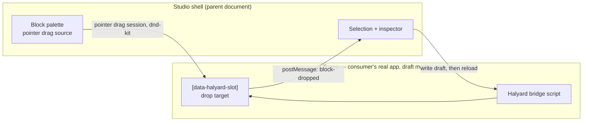

# Studio

How the self-hosted studio canvas, drag-and-drop, and preview are architected. The editor
an author uses. Pulled and run alongside the consumer's app, never hosted by us.

## The studio is a self-hosted web application

The product is an application a consumer deploys and runs themselves, alongside their own
storage and CDN. Its canvas is an iframe of their site. Layout and states are specified in
[`08-studio-wireframes.md`](wireframes.md).

**Self-hosting is what makes the iframe unproblematic.** A hosted vendor cannot ask every
customer to change their `Content-Security-Policy`, which is why Builder ships a Chrome
extension whose stated job is rewriting `X-Frame-Options` and `frame-ancestors` — and only
while browsing `builder.io`. When the person deploying the studio is the same person who
controls the site's headers, that whole class of problem is a configuration line:

| Studio location | Requires |
|---|---|
| `www.example.com/halyard` — same origin | `frame-ancestors 'self'` |
| `halyard.example.com` — subdomain | `frame-ancestors https://halyard.example.com` |
| Headers not under your control | The extension |

This is a smaller obstacle than it looks. A policy sent in report-only mode does not block
framing at all, which is a common posture. Where a policy *is* enforced, `frame-ancestors`
is typically assembled by the consumer's own header-building code, so permitting one
additional origin is a one-line change rather than a negotiation with a vendor. The only
real cost is blast radius, when one header builder is shared across several applications.

### Two optional surfaces on top

Neither is required to use the studio; both remove a step.

- **Extension** — the escape hatch when headers cannot be changed (an agency editing a
  client's site, a platform you do not control), and a way to edit in place on the live page.
- **In-site script** — in-place editing without an install, and the only path that reaches
  people on tablets, where extensions effectively do not exist.

The rule that lets one studio bundle serve all three hosts is below: **learn about the page
only through the DOM.**

---

> The sections that follow were written when an iframe canvas looked like the hard case.
> They are retained as the record of why the cross-document problems were considered and
> what was learned, not as the plan.

## Historical: the studio as an extension

An author browsing the real site sees an editing toolbar because they are signed in as an
editor. They click Edit, change the page in place, and publish. No separate application, no
page picker, no cold start — the model chosen because the people using this work in
marketing, SEO, and media, and the flow with no context switch is the one they will use.

**It ships as a browser extension, not as code inside the consuming app.** Three reasons,
in order of weight:

1. **Zero footprint.** The consumer's apps gain no studio bundle, no route, and no editing
   surface in production. Where an organisation runs several apps on one origin — a legacy
   app and its replacement, say — script injection would mean touching both and coordinating
   their deploys. An extension touches neither.
2. **It can defeat CSP.** Builder ship an extension partly for this reason: theirs *"rewrites
   server response headers that restrict iframe embedding"* — `X-Frame-Options` and
   `Content-Security-Policy`. A host that sets `frame-ancestors 'none'` blocks any in-app
   iframe permanently; an extension keeps that option open via `declarativeNetRequest`.
3. **One build, every target.** Production, staging, and a developer's local server are the
   same extension pointed at a different origin.

**The developer flow is the same extension pointed at a dev server** — build a block, see it
in the editor with HMR.

### Discovery: the page advertises itself

The renderer emits a signal on managed pages, and only on managed pages:

```html
<script type="application/json" id="halyard-page">
{"documentId":"…","route":"/landing","artifact":"a3f9…"}
</script>
```

**A DOM element, never a `window` global.** A content script runs in an isolated world and
cannot read the page's JavaScript, but it can read the DOM — the same reason block roots
carry `data-halyard-node`.

No signal means no toolbar. A checkout page, a search result, any coded route: the extension
is inert. Fail-safe by construction, with no allowlist to maintain, and it answers directly
the fact that most pages in an application are not editable.

The signal is inert metadata and can be emitted for everyone; the catalog and draft APIs are
what require authentication.

### What lives where

| Piece | Where | Why |
|---|---|---|
| Studio UI — palette, inspector, overlay, page list, creation | **Extension**, side panel | The part that sits on top. Needs no route in any app. |
| Renderer and catch-all route | **The app** | Irreducible — it *is* the page. |
| Draft store, compile, publish API | The app's routes **or** a standalone service | A separate service keeps the consuming app at zero new routes. |

Page creation lives in the extension's side panel, so no admin route is needed at all.

### Two hosts, one studio

The extension is not the only delivery path, and shipping both costs very little. The same
studio bundle can be injected by a content script **or** loaded by a `<script>` the app
renders for signed-in editors.

| | Extension | In-site script |
|---|---|---|
| Footprint in the app | None | A gated bundle |
| Several apps on one origin | Covered at once | Per app |
| Rewrite CSP / `X-Frame-Options` | Yes | No |
| Requires an install | Yes | No |
| Locked-down machine, or iPad | Blocked | Works |
| Distribution latency | Store review | Deploy |

The in-site path reaches people the extension cannot — marketing staff on tablets, and
contractors nobody wants to onboard onto an extension. It is also the better front door for
an open-source project: *add a script tag* is an easier first run than *install our
extension*. The extension answers the zero-footprint requirement; the script answers
adoption.

**The rule that makes both possible:** a content script runs in an isolated world and cannot
read the page's JavaScript. So the studio may learn about the page **only through the DOM** —
the signal element, `data-halyard-node` attributes, and measured rects. Never a `window`
global, never React internals, never a page-side registry object.

This is already the design; the risk is a later shortcut. It fails silently — everything
works in-site while the extension quietly stops finding blocks — so it belongs in a boundary
rule rather than in memory.

The residual differences are auth (the in-site script rides the page session; the extension
needs its own) and CSP (the in-site script needs the app's nonce, which Next supplies; the
extension is not subject to it).

### Costs to accept

Store review and its release latency, a build per browser engine, MV3 service-worker
constraints, and — the serious one — **host permissions on production**, which will and
should get a security review. Mitigate by keeping everything in the isolated world, scoping
host permissions to the consumer's own origins, and requiring authentication on every write.

### What choosing this removes

| Problem | Status |
|---|---|
| `frame-ancestors 'none'` hardcoded in the target host | Gone — nothing is framed |
| An edge proxy owning most of the origin | Gone for editing; only the admin route needs a path |
| Cross-document drag, pointer-capture handoff | Gone — one document, ordinary dnd-kit |
| DOM → node id across documents | `document.querySelectorAll` |
| Coordinate translation, zoom-aware rect math | Gone |
| Draft-mode cookie scoped to the wrong origin | Gone — same origin as the page being edited |

### Viewport preview without an iframe

The iframe was retained for one capability: media queries evaluating against a chosen width.
A **popup window** gives that too — `window.open(route, "_blank", "width=375,height=812")` is
a real viewport with real media queries, real device-pixel handling, and no framing, so it
sidesteps the CSP entirely and is more faithful than an iframe. DevTools device mode remains
the power-user path.

The cost is honest: an author cannot see 375px and the inspector side by side, they toggle.
Acceptable for marketing editing; a designer wanting live side-by-side is a later want.

### What the overlay still needs a route for

Creating a page. You cannot edit a page that does not exist, so a thin `/halyard` admin
surface owns the page list, creation, and settings — while everything else happens in place
on the page itself.

### Serving: ISR is the recommended model

For Next consumers, the catch-all route pairs with incremental static regeneration:

- `generateStaticParams` enumerates known routes from the route pointers.
- `dynamicParams: true` means a page created minutes ago — absent from that list — is still
  reachable: the catch-all resolves it against the route pointers, renders, and caches. **This is
  what makes "publish without deploy" true in practice.**
- Publishing calls `revalidatePath(route)`, invalidating exactly one page.

A recommendation for the Next binding, not a requirement of `core`; it is what we test and
document against.

---

*The remainder of this document predates the overlay decision.*

## The canvas is the consumer's real app

The canvas is an iframe rendering the consumer's actual application in draft mode — not a
re-implementation of it. Selection and drop targets are overlaid on top.

This is the whole reason the project is worth building. A canvas that re-renders blocks in
the editor's own React tree cannot show a server component, cannot run the app's data
fetching, and drifts from production CSS. An iframe of the real app cannot drift, because
it *is* the app.

It also creates the single hardest technical problem in Halyard: **dragging a block from a
palette in the parent document into a drop target inside the iframe.**

## The canvas is a dev server, not staging or production

An earlier draft proposed mounting the studio as a route inside the consumer's production
app to make the iframe same-origin. Review found that unworkable against a realistic
deployment, on two independent counts: a header builder that hardcodes `frame-ancestors
'none'` with no override, and an edge proxy owning most of the origin, so an
`app/halyard/page.tsx` would never receive the request at all.

**Point the canvas at a purpose-run dev server instead.** The consumer's real app, real
components, real CSS — running in development mode with dev overlays suppressed.

Six of the eight findings against the previous approach dissolve rather than needing fixes:

| Problem | Why it goes away |
|---|---|
| `frame-ancestors 'none'` | The dev server sets its own headers. Production CSP is untouched. |
| An edge proxy owns most of the origin | The dev server is its own origin, not behind the edge. |
| No lever to exclude the studio from a production build | It never enters one. |
| Draft cookie bleeding into normal browsing | Different origin from the production site. |
| Studio auth grafted onto customer NextAuth | A dev-server session is a separate, smaller problem. |
| RSC re-render cost per edit | A dev server already refreshes RSC payloads constantly and is instrumented for it. |

What does **not** change: mapping a rendered element back to a node id, and the
cross-document drag limitations. Both are properties of using an iframe at all.

### What it costs

Someone has to run it. Locally is a non-starter — a marketer has no checkout, which is
exactly why Onlook's model doesn't fit. So it is hosted, and the choice is:

- **Per-session container** — full isolation, a container per editing session. Onlook's
  CodeSandbox approach; real per-session cost.
- **Shared editing environment** — one long-running deploy in dev mode. Much cheaper,
  but concurrent editors share one process and HMR is global to it.

Fidelity is a fair question and the answer is good enough: dev mode differs in bundling,
minification, StrictMode double-render, and dev warnings. None of those move layout or
styling, which is what the canvas exists to show truthfully.

### One render path, and therefore one preview mode

Every page renders through the server catch-all — `app/[[...slug]]/page.tsx` resolves a
document and renders its tree. That has two consequences worth stating, because they remove
a problem and a feature at the same time.

**It removes the two-tier editing experience.** Review flagged that a true server
component's code never reaches the browser, so client-side prop patching works only for
client-component blocks — giving server-component blocks a worse editing experience, with
nothing to catch an author choosing wrong. If every block renders server-side through one
path, that asymmetry cannot arise. The cost is uniform, and uniform is the point.

**It removes the live postMessage preview.** An earlier draft had the studio push the draft
tree into the iframe for client-side re-render. That is impossible for a server component
for the same reason, so the mode was partly fictional. Preview is server-rendered, always.

This converges with an independent constraint: the drag adapter cannot read dragged data
during hover, only on drop — so live preview *during* an interaction was never available
either. **The canvas updates on commit, not continuously.** The inspector holds local state
while typing and the canvas refreshes on debounce or blur, which is how most CMS live
previews already behave.

The studio's preview route is therefore the same code path as the public catch-all, given a
draft document instead of a published artifact. Note also that the production path does
**not** parse schemas — it reads a pre-validated artifact. Schema work happens at publish
and in preview only.

## Storybook is the architectural reference

Not a dependency — a proven shape for exactly this problem, and one the team already knows
for any team already working Storybook-first.

**A story is a node.** CSF is a component reference plus an args object:
`export const Primary = { args: { label: 'Button' } }`. That is `Node { block, props }`. A
Halyard document is a composed, persisted, routed tree of stories.

**`argTypes` corroborate the hint decision.** Storybook infers a control from types and
lets you override per-arg in a structure **keyed by arg name, parallel to the component**:
`argTypes: { size: { control: { type: 'select' }, options: [...] } }`. That is the third
independent system — with rjsf's `uiSchema` and JSON Forms' `uischema` — choosing parallel
over embedded. Also worth copying: when no control matches, Storybook degrades to read-only
JSON rather than dropping the field.

**Manager / Preview over a typed channel.** The manager is the outer chrome; the preview
renders the story; they communicate through a typed event vocabulary — `SET_CURRENT_STORY`,
`UPDATE_STORY_ARGS`, `STORY_ARGS_UPDATED`, `STORY_RENDERED` — rather than ad-hoc messages.
`UPDATE_STORY_ARGS` is literally our prop edit. Define the vocabulary as a protocol: it is
what makes third-party inspector panels possible at all, and it holds whether the preview is
an iframe or an in-page overlay.

**`globalTypes` fills a gap we had.** Storybook carries preview-level state that is not
component props — theme, locale, viewport. Halyard had no concept of it, and previewing a
page as a different locale, or logged-in versus anonymous, or at a breakpoint, is exactly
that. It needs a home in the model, separate from `Node.props`.

## Viewport controls

Named presets plus a free-drag handle, defaulting to **the consumer's own breakpoints**
rather than invented ones — read from the consumer's config, so a design system contributes its own scale
(xs 320 · sm 480 · md 768 · lg 1024 · xl 1280 · 2xl 1440).

This is the capability that earns the iframe. MDN: *"The visual viewport of an `<iframe>`…
is the size of the inner width and height of the respective element, rather than the parent
document"*, with CSS2 §9.1.1 (*"at most one viewport per canvas"*) and a CSSWG test for the
media-query case. A same-document container cannot do it — queries would evaluate against
the browser window.

## The block palette

**Devs author no separate visual.** The input already exists for other reasons: a block
needs `defaults` so a dropped Hero does not start with an empty required `title`, and the
same values feed stress-content generation. A block rendered with its defaults *is* its
preview, and it cannot go stale.

| Density | Shows | Cost to the dev |
|---|---|---|
| Compact list | Icon, name, description | An optional `icon` |
| Hover / expand | The real block rendered from `defaults` | None — a server render, cached |

Server-component blocks preview fine here, because the preview path is a server render
already: ask it for a single-block document and real HTML comes back. This is where our
architecture is *easier* than Storybook's, whose preview is a client renderer trying to
accommodate RSC.

Avoid hand-authored screenshots — they go stale the first time a component changes and
nothing catches it. Builder.io's `ComponentInfo.image` is the precedent for the optional
icon.

## Design-tool round trip

```ts
defineBlock({
  name: "Hero",
  docs: {
    figma: "https://figma.com/file/…?node-id=123%3A456",
    storybook: "?path=/story/patterns-hero--default",
  },
})
```

Opaque strings the consumer supplies, so no coupling and no styling opinion. The studio
renders "Open in Figma" / "Open in Storybook" for the selected block.
`@storybook/addon-designs` already embeds Figma frames in a Storybook panel and Figma Dev
Mode links out to stories, so both ends of the round trip exist — Halyard only carries the
identifiers.

### HMR serves the developer, not the author

Worth separating, because it changes what the dev server is *for*. Marketing edits **data**
— props on a node — and a data change is a draft write plus an RSC refresh, which works
identically in a production build. HMR only matters when **code** changes, which happens
when a developer is building or tuning a block and wants to see it in the studio
immediately.

That is a genuinely valuable workflow and an argument for the dev server. It is not an
argument that authors need one, so the two cases may deserve different hosts: a dev server
for block development, and a cheaper production-mode preview environment for authoring.

## Library decision — dnd-kit, not pragmatic-drag-and-drop

**Revised.** An earlier draft chose the Atlassian adapter. Verification
against primary sources reversed it on two counts.

**Pragmatic cannot bridge a same-origin iframe with pointer events.** Its element adapter
binds to the global `document` singleton rather than `element.ownerDocument`, and the
maintainer states the design intent directly: *"Pragmatic drag and drop expects each window
to manage its own drag and drop rather than one window trying to manage another."*
Atlassian's own recipe for crossing the boundary is the **external adapter** — native HTML5
`DataTransfer` — which reintroduces exactly the limitations that made it look expensive:
data unreadable during hover, drop detection via non-public `dropEffect`, and no Android.

**dnd-kit already solves this.** `@dnd-kit/dom`'s `getDocuments()` recursively walks
`iframe`/`frame` elements, catching the `SecurityError` on cross-origin access to skip them,
and `PointerSensor` binds `pointermove` / `pointerup` / `pointercancel` on every discovered
same-origin document. It is shipped and changelogged (PR #1517, "Support dragging across
same-origin iframes"), documented on dndkit.com, and covered by a Playwright regression test
with a working example. MIT.

Because it is pointer-based and same-origin, full drag state is retained throughout — no
MIME marshalling, no hover blind spot, no `dropEffect` sniffing. **dnd-kit is the library
this project builds the bridge on.**

### The one real gotcha, which every implementation hits

**Pointer capture and event delivery do not automatically hand off between the parent
document and the iframe document mid-drag.** This is a genuine, still-partly-open browser
issue — Chromium #882491 and #327409885, Mozilla #1151152 — and Puck hit it in production
(#1430, `NotFoundError` on `setPointerCapture` "dragging near iframe boundaries"; the
maintainer: *"we've seen before"*).

Every surveyed builder solved it deliberately, differently:

| Builder | Approach |
|---|---|
| **Plasmic** | Pure pointer events, manual `clientToFrameRect()` translation that also divides by studio zoom. No HTML5 DnD anywhere. |
| **Makeswift** | Pointer events captured inside the iframe, forwarded to the parent over `MessageChannel`, parent pushes translated cursor back for the iframe to hit-test locally. |
| **Puck** | Portals its tree into an `srcDoc` iframe, re-dispatches pointer events via a custom `BubbledPointerEvent`, with its own `NestedDroppablePlugin` hit-testing and zoom-aware `global-position.ts`. |
| **GrapesJS** | Native HTML5 DnD with a pointer fallback — the one counter-example, and it predates modern pointer sensors. |

Pick one pattern and build it deliberately. Pointer events alone do not "just work" across
the boundary, and known rough edges remain (dnd-kit #1705, scroll offsets across frames).

Coordinate translation by `iframe.getBoundingClientRect()` is mandatory, not optional: MDN
is explicit that `elementFromPoint` and rect coordinates are relative to *the document the
method runs on*.

### Why not the alternatives

Cross-document drag is the thing no page builder gets for free:

| Candidate | Why not |
|---|---|
| **Puck** (MIT, 0.20.2) | Closest in spirit, best field model. But the maintainer answered this exact question in issue #620 ("External Site Editing") with "We currently do not support this." Its iframe mode wraps Puck's *own* render, not an external app. Latest stable is 0.20.2 with canaries trailing off around Dec 2025. |
| **Craft.js** (MIT) | Excellent recursive canvas model, but roughly 18 months without commits and a rewrite promised since 2023. Community reports broken drop-indicator coordinates inside iframes. |
| **GrapesJS** | Has rendered its canvas in an iframe since inception and *still* has open issue #2463 confirming drag-from-outside-into-iframe doesn't work. Useful corroboration that this is genuinely hard. |
| **react-dnd** (MIT) | Gets cross-frame drag free via native HTML5 backend, but no release since 2022 and no keyboard sensor. |
| **Makeswift** | Commercially proves the iframe-the-real-app thesis, but the studio is proprietary. Validation, not a dependency. |

Adopting a page builder would not have saved the other half of the work either: **none of
these ship a Standard Schema → field UI adapter.** That is greenfield regardless.

## Bridge architecture



postMessage carries **events** — drop, selection, and element bounds up to the studio. It
never carries the drag itself, and it never carries a tree down: a committed change is
written to the draft store and the iframe re-renders from the server. That split is what
makes the drag feel native rather than a coordinate-relaying simulation, and it is why the
canvas stays honest about server components.

## Stress content is generated, not authored

Atomic Design's argument for pages is that they are where a design system meets reality:
they test *"how all those patterns hold up when real content is applied"*, and a designer
should build pages accounting for *"different cart sizes, variable headline lengths, user
permission levels"* — because those variations *"directly influence how the underlying
molecules, organisms, and templates are constructed"*.

Frost has to author those cases by hand. **Halyard has the schema, so it can generate
them.** From `z.string().max(80)` come an 80-character value and a one-character value;
from `z.array(bulletSchema).max(4)` come four items, one item, and — if optional — none.

That makes a studio affordance worth having early: preview any block or page at its
content extremes, without an author inventing the awkward cases or discovering them in
production. It falls out of being schema-first and is expensive for any system whose field
config is hand-written.

## Consequences to design around

- **Same-origin is likely required.** Every demonstrated example of cross-document drag in
  the libraries reviewed is same-origin only; cross-origin is unsolved in every one of them,
  including the one adopted here. This is why self-hosting the studio matters — see the
  project's [open design questions](https://github.com/effekt/halyard/issues/15).
- **Server component re-render after an edit is unaddressed by every tool reviewed**,
  because none of them render through a real external server-rendered app. Whether an edit
  patches props client-side or refetches an RSC payload is a Halyard-specific decision, and
  it is on the critical path for how the live preview feels.
- **Accessibility across a document boundary is untested territory.** A live-region
  announcement and an action-menu reorder path alongside pointer drag are worth building
  from the start rather than retrofitting, since a keyboard drag that crosses into an
  iframe may simply not be announceable.
- **Next 16 App Router compatibility is unverified for every candidate.** Worth a spike
  before committing.
